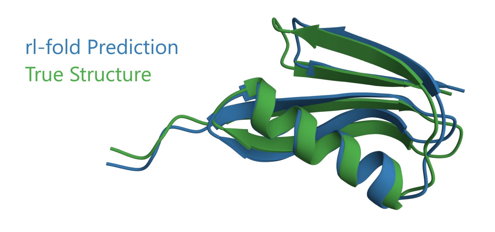

_Figure: Comparison of rl-fold reconstruction to the experimental structure of PDB 2IGD, chain A._

# rl-fold
Applying reinforcement learning techniques to the protein structure prediction problem.

rl-fold is [Steven Laverty's](mailto:sdlaverty123@gmail.com) Master's Research Project in affiliation with [Rensselaer Polytechnic Institute](https://science.rpi.edu/computer-science) and research advisor [Mohammad Zaki, PhD](https://faculty.rpi.edu/mohammed-zaki).

## Features
rl-fold implements a custom [Gymnasium](https://gymnasium.farama.org/) environment to predict protein structure. The task is implemented as *fragmented protein reconstruction*, which involves reassembling a 3d protein structure given a sequence of protein fragments.

The environment loads a [PDB](https://www.rcsb.org/) protein structure and breaks it into fragments of $N=8$ amino acids each, with randomized initial cropping. Each of these fragments is assigned a vectorized representation based on the displacement between the first backbone atom in the fragment and the final backbone atom in the fragment. Starting with the first fragment, the agent is tasked with predicting the relative angle between each successive pair of fragment vectors. As each relative angle is predicted, the reconstructed protein is assembled incrementally. The agent is further informed by this intermediate structural information. After predicting the final relative angle, the agent is rewarded with the negative [frame-aligned point error (FAPE)](https://www.nature.com/articles/s41586-021-03819-2) loss between the reconstructed protein structure and the true protein structure. The agent is rewarded with zero for all earlier time steps.

Optional environment wrappers are provided to:
- Convert observations to human-readable Python dictionaries
- Convert observations to unit-scaled numpy arrays suitable for NLP-style embeddings
- Map independent polar and azimuthal angle predictions to joint angle predictions
- Regularize FAPE loss by the absolute length of the protein sequence

rl-fold features an automated configurable training pipeline. Two reinforcement learning algorithms are available:
- [Deep Q Learning](https://www.nature.com/articles/nature14236)
- [AlphaZero](https://www.nature.com/articles/nature24270)

The training pipeline is optimized to utilize distributed hardware.

Simulation and visualization utilities are also provided to export predicted structures to `.pdb` files.

## Installation (Local)

All Python dependencies are specified in `environment-local.yml`. If you have `anaconda` or `miniconda` installed, you can simply run:
```
conda create --file=environment-local.yml
```

You'll also need to to acquire PDB files in [mmCIF format](https://files.wwpdb.org/pub/pdb/data/structures/).

### Using a GPU

To enable GPU training, you must also install PyTorch with CUDA (follow installation instructions at [Pytorch.org](https://pytorch.org/get-started/previous-versions/#v120)). If you have `anaconda` or `miniconda` installed, run:
```
conda install cudatoolkit=10.1 -c pytorch
```

## Installation (Distributed Server)

For usage on IBM Power9 architecture.

All Python dependenceis are specified in `environment-aimos.yml`. If you have `anaconda` or `miniconda` installed, you can simply run:
```
conda create --file=environment-aimos.yml
```

You'll also need to to acquire PDB files in [mmCIF format](https://files.wwpdb.org/pub/pdb/data/structures/).

The `bash` scripts in `scripts/` are intended for use on [RPI AiMOS](https://cci.rpi.edu/) with the SLURM job scheduler. These will need to be tailored for individual use.

## Usage

All scripts should be run in the root directory of the repository.

### Training

To begin the training pipeline, run:
```
python train.py [OPTIONS] [config_file] [num_iterations=1]
```

For more detailed CLI specification, run:
```
python train.py -h
```
or
```
python train.py --help
```

Training scripts make use of JSON configuration files. For detailed documentation about the format of these configuration files, refer to the `Config` class defined in `utils/utils.py`.

The provided config files serve as examples, but they will need to be tailored for individual use (see `"pdb_path"`).

Additional CLI tools are provided to aggregate and visualize training results:
```
python collect_results.py [OPTIONS] [config_file] [out_file]

python plot_results.py
```

### Simulation

To predict a specific protein structure using a trained model, run:
```
python simulate.py [method] [model_file] [pdb_file] [chain_id] [-o out_file]
```

- `method` should be either `deep-q` or `alpha-zero`
- `model_file` should be a model checkpoint produced by the `train.py` script
- `pdb_file` should be a mmCIF file
- `chain_id` should be an uppercase letter
- Optionally, `out_file` is the name of the a file where the true structure, predicted structure, and reconstruction error will be saved in plain text `.pdb` format.
